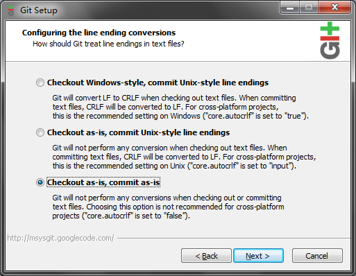

# N935专用git简明讲座  

> author by galin [cuter44@qq.com](mailto:cuter44@qq.com)  
> license by CC 3.0 BY  

Yooooo! 这里是galin, 今天要讲解的是git的配置和使用方法(Windows向, Linux党除了配置环境变量稍有出入的话应该问题不大, CLI爱好者请自己搜咯).  
这个教程是使用了开发中的TVProtal项目作为<del>场景</del>脑内小剧场, 好处是这样写更易懂也更贴合现在的工作流, 坏处是**实际中使用的工作流不是这样子**的(°д°)b, 我的想法是大家借这个doc了解git的用法并且在10分钟之内就可以上手, 但是如果你想要将git转变为一种可迁移技能的话你应该阅读更多资料比如[GotGitHub](http://www.worldhello.net/gotgithub/)(很抱歉我已经找不到更多的,存活的,不用翻墙的,中文的教程了)  
最后一句废话: 有硬伤的话请不吝吐槽m(_ _)m, 好下面是正篇.  

> 剧本: galin  
> 主演: galin, FTS, wjh, xillkey (后面两人是我杜撰的请勿介意)

## Chapter 0 服务器的安装和配置  
留给FTS写.  
本章完

## Chapter 1 客户端安装和配置  
作为程序猿一定要养成去发行源下载的好习惯! git的发布地址是 [http://git-scm.com/](http://git-scm.com/), 不过目前已被墙所以我就黑心点自己配了个源:  

[点此下载无毒无木马无广告无暗扣\_(:з」∠)\_](./bin/Git-1.7.11-preview20120620.exe)  

已经装好的话点[这里](#finish-install)跳过

安装过程很人性化:  
  
next!  

  
next!!  

  
个人喜好即可  

  
建议这么点  
如果你机器上已经安装有Mingw GCC或者类似东西的话那么你已经自带了一个MSYS(用来在Windows上模拟Bash的工具), 此时你可以考虑不点最下面那个.sh  

  
next!!!  

  
建议这么点  

  
建议这么点  
因为实验室里面有人(比如FTS)用Linux点这个是对Linux党和Windows党的人文关怀~

到这里就装完了, 首次起动之前, 你需要和FTS或galin联系为你建个新的帐号. 如果你熟悉SSH和Bash的话也可以自己来:

    ssh root@10.50.9.1  
    # 密码是rootroot  
    useradd 你的id -Gn935  
    passwd 你的id  
    # 然后按提示帮自己设密码  
    logout  

顺带一提git的bin目录下自带OpenSSH你懂的, path的话我忘记要自己添加还是它自动帮你加的了, 反正你懂的╮(╯▽╰)╭  
  
很好你现在已经有帐号密码了, 来战个痛决!
  
开始菜单 > git GUI ↓  
  
由于TVProtal已经写好成吨的代码了这里我们选克隆.  

  
这里将galin换成你自己的ID \_(:з」∠)\_  
以及由于我昨晚乱搞的关系现在的Source Locatio已经变成了 `你的id@10.50.9.1:/root/projects/tvprotal/.git`了  
让你输入什么就输入好了, 无脑操作 ╮(╯▽╰)╭

<del>回车然后它会提示"You appear to have cloned an empty repository"囧, 这是写教程时的状况请不要介意~</del>

(赞助商广告时间)  
Yoooo! [galin@Github](https://github.com/cuter44/)求勾搭~  

欢迎继续收看git讲座脑内小剧场(卖笑)  
呃呃呃鉴于出了点小状况我们从上上步重新来过, 时间关系我已经在幕后用命令行clone以及各种非正常手段...反正现在我们已经拿到版本库就对了.  
刚才如果成功clone的话会显示"最近的版本库", 我戳~  

  
一点都不帅对吧, 想要装逼的话你可以试下用[Git Extensions](http://sourceforge.net/projects/gitextensions/), 走好不送.  

用之前还要适当配置:  
编辑(edit) > 选项(options)  
用户名和邮箱是必填的(责任追踪到人!), 填全局还是版本库随你, 其余选项按个人喜好~  
现在除了带有clear/delete/rename/reset之类的危险字眼的操作其它你可以四处逛逛了, 不过后面我们会讲解大部分功能的.  

**科普向**  关于git的分支概念:   
  
图示是galin的伪春菜的branches图(典型反例请勿模仿).  

git对分支的限定相当宽松, 你可以以任何一个节点为基础(base)派生出新分支(甚至可以凭空(orphan)生成分支), 分支也可以随时被合并到其它分支中.  
这样做的好处是**能够在合作编程时最大程度地避免干扰**(因为冲突只会发生在合并操作时), 合并时git可以很智能地自动合并大部分更改, 在git无法处理的情况下它会提示用户具体哪行发生了冲突, 然后由用户选择保留谁的修改(注意是选择~单选题壁简答题容易好多对不对?).  

通常会设定一个主分支, 以作为派生分支的基准和可以发行的副本(记住就好, 现在不用理解这个概念)  

还有我想吐槽的是由于坑货FTS的缘故, 本来我们还可以架个私有的[GitHub](https://github.com)(好处是集成了代码直接下载/即时代码吐槽/错误追踪/wiki等有用功能), 但是现在没有, 我-很-不-开-心(本章完)  

## Chapter 2 xillkey之章(日常的使用状况)

2013年8月某日, xillkey刚来准备做网页渲染, galin在补觉, wjh...不知道在干嘛.  
xillkey启动了电脑, 首先它需要从版本库拿到昨晚wjh合并好的新版本(假设他昨晚做的更改已经交给wjh合并了, 当然并不需要每晚合并)并创建自己的分支(**重要** 这是避免冲突的法门)  
分支(branch) > 新建(create) ↓  
  
这样就行了...哦截图时分支名字忘了填, 写自己喜欢的标识符就好(但是最好能顾名思义, 因为大家都能看到)
  
这里假定xillkey增加了一个css文件, 这个改动会被反映在git的面板上↓  
_没看到? 我才不会告诉你要点 重新扫描(rescan) 呢_  

点文件名可以查看变更的内容, diff可以显示行级的修改情况.  
点图标就可以将所作的变动保存到绿色框的区域下来↓  
两个框都支持同样的交互哦, 简单直观~  
  

xillkey可以随时点提交(commit)保存已经缓存的改动, 提交操作不会实际上传数据到服务器, 而是将在本地生成一个保存点(打机时的checkpoint都知道?).  
所有已经下载到本地(fetch)的更改记录都可以用分支查看器检视↓(在版本库(repository) > 查看所有分支历史(visuallize all branches' history))  

假如xillkey发现他将代码改到太糟糕想倒回去的话(那天晚上我们在调IE不能显示格子就是实例), 他可以在这个界面想要回退到的节点上面点右键 > Reset xillkey branch to here, 然后代码就会被回滚到相应位置了.  

若干小时后...  
xillkey认为他已经完成工作了, 他可以最后commit一次, 然后点上传(push)(再强调一次只commit不push的话是不会将修改打入服务器的, FTS今天就是这样坑我的)  
  
可以一次上传多个分支, 只有选中分支的更改会上传到服务器. 目标版本库的话由于只有一个所以不用费心了.  
上传后的版本库如图↓(注意wjh在这几个小时内也做出了自己的更改)  

根据老邝原本的设定是要由wjh负责做整合的. 所以此时 xillkey 只需要确认上传完了就可以关机走人了, 当然走之前还需要:  
xillkey(^ω^): 搞掂, wjh记得将我改的部分合并进去~  
wjh(T▽T): はい、はい。。。

**科普向** 随手merge解救wjh  
通常来说代码是你写的肯定是你最清楚要改哪里才对, 将代码交给别人做合并其实是一个很不"业界良心"的事. 虽然说使用显式分支可以大大降低冲突的机会, 但还是不能完全避免冲突的. 苦逼的wjh在合并时如果不发生冲突还好, **发生冲突的话他就要苦逼地找造成冲突的责任者来解决问题.**  
接下来的一章将会讲解最常用的merge操作, 如果你想继续坑wjh的话看到这里就够了, 继续看下去的话...不好意思没有奖品.
(本章完)

# Chapter 3 wjh之章(自动合并:wjh的救赎之路)

好吧这章是专门写给wjh看的我们一切从简.  
即使是贵为wjh的存在也是不应该直接动master分支的, 所以wjh也有自己的分支.  

若干分钟前, wjh接到了xillkey的merge请求. 于是他叹了口气, 保存自己的工作, 打开git GUI 切换到master分支上↓  
  
(**注意:在切换分支前最好先将正在工作的分支stage+commit一次, 否则未缓存的改动可能会被切换分支覆盖掉**)(假如将会发生这种情况的话git会预警并阻止你check out, 但是做人还是自重点比较好)  
(**注意**:check out之前最好先 remote > fetch 一次以保证本地的内容是最新的, 否则merge就没意义了, fetch操作不会丢失任何的本地内容(即使未保存)可以放心使用)  
哦顺带一提所谓"跟踪分支(remote branch)"完全是个翻译错误, 正确意思是"远程分支". 翻译的资源文件在`Git\share\git-gui\lib\msgs\zh_cn.msg`, 谁闲得蛋疼可以做个完全版的patch出来造福人民(反正我是打开那个文件后就完全没兴趣了)  

现在可以开始merge了, 点 合并(merge) > 本地合并(local merge)↓  
  
选择xillkey的分支, 然后合并, 如果没发生冲突的话, 合并就完成了↓  
(注意 master 已经进化到和 xillkey 同一水平)  
  

**科普向** 分支可以重用吗?  
答案是可以的, xillkey在第二天来的时候可以  
 1. 从 master 创建新的 branch,  
 2. 从 master 合并到 xillkey(推荐),  
 3. 直接在 xillkey 上修改完成后再次合并到 master(极不推荐),  
反正无论如何最重要的一点是**绝对不要合并到别人正在写的分支上!!!!!**(svn就是因为存在这种问题才很难用的)  
三种方法是有差别的, 这是个逻辑问题这里就不展开说了.

(本章完)

# Chapter 4 galin之章(冲突的解决办法)  

5点通常都是叫外卖的时候, 既然有了 git 的合并功能, 那么在 QQ 上吆喝谁吃什么再手动收集显然是不科学的事.  
所以, wjh创建了一个调查表what-to-eat.txt来收集订餐状况.  

what-to-eat.txt(master分支的内容)

    (空白)

饱睡的galin听到"外卖"两字瞬间暴起以最快速度完成了branch-commit-merge操作:

what-to-eat.txt(galin, master两个分支的内容)

    galin(ﾟДﾟ；):我要吃肉卷饭!!

而xillkey则慢了一步, 在galin修改文件时他才刚好fetch完, 当他merge的时候, 冲突发生了:  
  

此时同一文件的不同状态是:

what-to-eat.txt(xillkey分支的内容)

    xillkey(‾▽‾"):我要烤鸭饭好了.

what-to-eat.txt(master分支的内容)

    <<<<<<< HEAD
    galin(ﾟДﾟ；):我要吃肉卷饭!!
    =======
    xillkey(‾▽‾"):我要烤鸭饭好了.
    >>>>>>> xillkey

同时git主面板会变得色彩斑斓:  
  
(不要吐槽乱码这个不是重点)  
那三行黄色的(对应源文件的三行)就是git加上去的, 意思是要提醒你哪里冲突了, 这时你要做的就是用编辑器打开冲突的文件(不能直接在git面板改), 改成你期望的结果.  

这里按照场景应该将两行都保留下来, 所以直接删掉第1,3,5行即可.  

如果你什么都不改或者漏了哪里没改的话, 你将会被git吐槽  
_愚蠢的人类你还没有解决冲突呢真的要保存吗? >是(灰色的) >否_

**科普向** 正确撰写commit message  
估计你在点"提交"时已经遇到过这个状况了, git不允许将这里留空, 这是个好习惯, 无论是单机还是团战, 知道某个节点改了什么内容是非常重要的.  
以下是摘自 cuter44(galin的马甲id)/librarica的某个commit:

    登录/激活功能追加完成
    
    + Web API, 详情请参见javadoc
      + /authorize/register
        ! 现在还不能发邮件, 但是会通过json返回激活之必要参数
      + /authorize/activate
      * /authorize/login
        + 追加了样例
      * /authorize/logout
        + 追加了样例
      * /authorize/getRsaKey
    + 追加Criteria机能, 详请参考wiki:Criteria
    + 追加了用于RSA加密的实用工具, 详请参考wiki:服务器部署指南

大概就是这样咯, 这种事见仁见智我就不说什么了\挖鼻

(完结, 应该不会有 episode 2 了)