# N935专用git简明讲座  

> @author galin&lt;[cuter44@qq.com](mailto:cuter44@qq.com)&gt;  
> @license [CC 3.0 BY]()  
> @version 2.0.0-build-20140421  
> older version -&gt; [./hello-git-2013.html](./hello-git-2013.html)  
> whenever you find a leak, feel free to report @[github issue](https://github.com/cuter44/hello-git/issues)  
> @acknowledge [MarkdownPad2](http://markdownpad.com/), [Github Pages](https://pages.github.com/‎)

# Chapter 0 Metadata
通常来说这个时候应该说下 _git是什么_, 不过出于无障碍阅读的原则, 今年的版本决定不说了. 现在, 只需要将 git 理解成 **一个可以在多人环境下随时保存和合并源代码的工具** 即可.  
然后, 本篇将以 5+0的脑内小剧场 和 wjh的黑历史相结合 去阐述怎么去利用git. 出于<del>时间根本不够</del>入门教学的初衷, 这篇教程会尽量避免复杂的东西. (但这也是git的一个特性之一, 他可以很简单, 也可以geek到完爆蓝星人智商的程度)

# Chapter 1 总之, 我们需要一个实验工具
那就是在自机部署一个 git 了.  
注意这一章不会在堂授课中讲述, 请先行完成.
## on Linux
一个命令搞掂:  

	apt-get install git

, 或者等价的包管理器指令(yum, pacman 等)

## on Windows
这里是适合普通人的操作步骤:  
首先要下载安装包, 以下源你可以随便挑一个:
  
* [git的官方发布](https://msysgit.googlecode.com/files/Git-1.9.0-preview20140217.exe)
* [这篇手札的附件](./bin/Git-1.9.0-preview20140217.exe)
* [这个教程在teambition的附件共享](https://www.teambition.com/project/5354b473e00e5c1311008751/home/work/5354cff026ad9223115b41ed)
* [度娘网盘](http://pan.baidu.com/s/1eQzKvuy)

然后该干嘛干嘛, 除了某些特殊的技能点:

  
建议这么点, 理由是用户体验比较好  

  
建议这么点, 理由是比较安全  

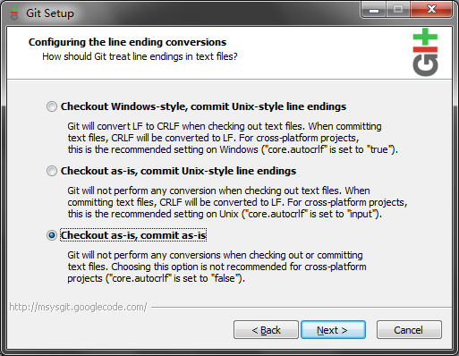  
建议这么点, 理由是你得给linux党一点人文关怀

## with [Github](https://github.com)
这不是必修的, 不过目前来说, 有个 github id <del>是很潮爆的哦~</del>才能实现全球流写代码.    
比如 [5+0@github](https://github.com/cuter44) ≧▽≦ 

> NOTE 其实不只全球流那么简单, github还有很多方便我等程序猿工作的功能, 比如 jekyll 托管(提供你目前正在看的教程的托管), 简单的错误追踪, [gist](https://gist.com/cuter44)  

> HINT 因为光缆君的傲娇和GFW的病娇, 你可能要修改hosts才能科学地上网:  
> 185.31.17.184  github.global.ssl.fastly.net

# Chapter 2 心に刻んだ夢を放て!

> 标题出自炮姐OP, 题图出自机巧少女, 图片仅供参考.

好吧目前还没有碉堡到这种↑程度咯 (´・ω・｀)  

总之什么都好现在可以打开刚刚装好的git吧, 如无意外开始菜单会多出名为 Git GUI 的东西(なに? Linux? Linux党会说不需要这个教程咯...), 会看到这个↓  

  
时间关系我们就先拿这篇教程的仓库来做范例吧, 请随意在原有基础上做修改, 因为我不在 github 上授权的话你是根本提交不了的23333
  
> NOTE ...不过其实授权后也能随意修改, **哪怕会造成毁灭性打击都没关系**, 这就是分布式源代码管理系统的彪悍之处.  

好吧回来正题, 选"克隆已有版本库",  
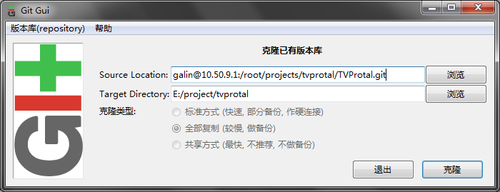

然后填入以下 param:  

	Source Location: https://github.com/cuter44/hello-git.git  
	Target Location: (自己的工程目录) 
  
完成之后会变成以下界面:

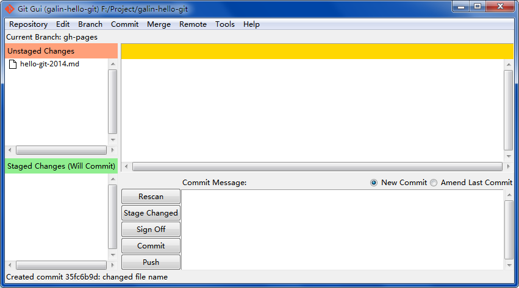

然后可以尝试下去点 `Repository` > `Visualize all branches history`  
然后你会看到一条直线, 这不奇怪, 因为这不是一个协作项目, 在我的刻意维持之下, 分支树退化成线性的. 但你仍然可以随意浏览下更新记录, 你会看到很多 ++/-- 的符号, 这些符号简明扼要地描述了我修改过哪些东西.

# Chapter 3 935日常 - xillkey的css

> 事实上这章说的是怎么提交代码, 跟 css 没有关系

2013年8月某日, xillkey(前端)刚来准备做网页渲染, galin(后端)在补觉, wjh(技术总监)...不知道在干嘛.  
xillkey启动了电脑, 首先它需要从版本库拿到昨晚wjh合并好的新版本(假设他昨晚做的更改已经交给wjh合并了, 当然并不需要每晚合并)并创建自己的分支  

> HINT 分支是避免冲突的有力武器, 一条重要的准则是不要随意触动别人的分支
  
`分支(branch)` > `新建(create)` ↓  
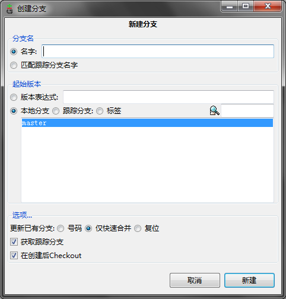  

这样就行了...截图时分支名字忘了填, 跟标识符一样可以随意命名, 但也跟标识符一样存在[某种规范](http://segmentfault.com/a/1190000000434973)
  
这里假定xillkey增加了一个css文件, 这个改动会被反映在git的面板上↓    
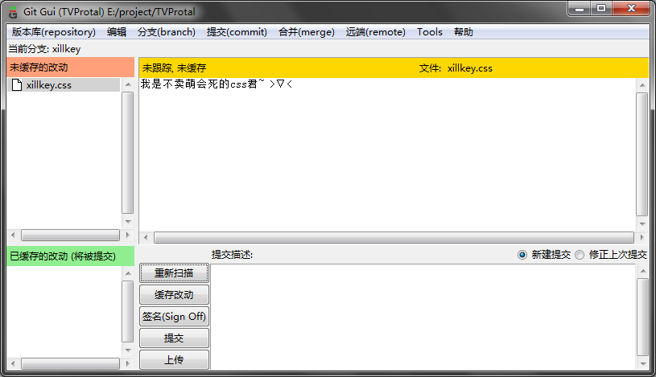  

> 如果没看到更改, 可以点下`重新扫描(rescan)`  

> WARN 这里循例要强调一次, 请直接在你`clone`下来的基础上修改, 而不是复制到别的文件夹修改完再覆盖回来(╯‵д′)つ)×﹏×)

点文件名可以查看变更的内容, 也就是上一章在历史记录中看到的 ++ 和 -- 们  
点图标就可以将所作的变动保存到绿色框的区域下来↓  
两个框的操作是互文的, 也就是说假如你误操作了, 再点一下可以不保存修改.  
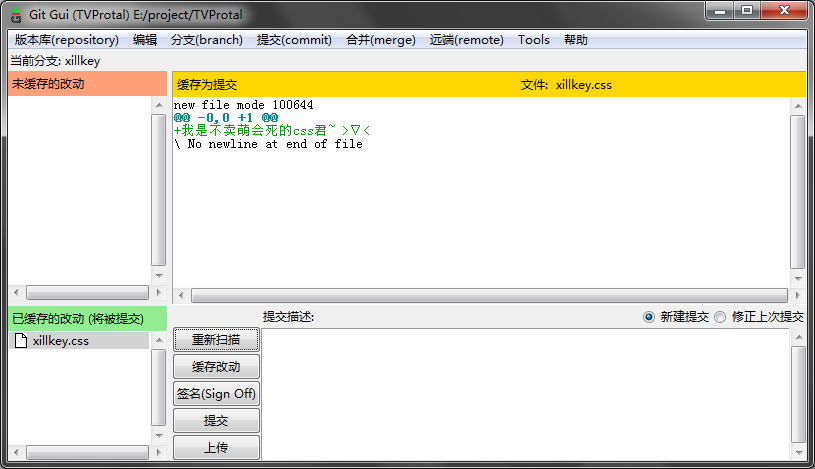  

> HINT 在这个界面的任何操作都不会影响到你已经写好的代码, 所以请放心大胆地乱来 \_(:з」∠)\_

xillkey可以随时点`提交(commit)`保存已经缓存的改动, 提交操作不会实际上传数据到服务器, 而是将在本地生成一个保存点.  
如果这时候再`查看所有分支历史(Visualize all branch history)`会看到这个样子  
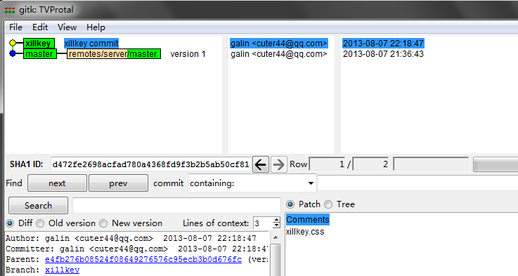

假如xillkey发现他将代码改到太糟糕想倒回去的话(比如写了一大堆才发现IE根本不鸟...), 他可以在这个界面想要回退到的节点上面点右键 > `Reset xillkey branch to here`, 然后代码就会被回滚到相应位置了.  

若干小时后...  
xillkey认为他已经完成工作了, 他可以最后`commit`一次, 然后点`上传(push)`(关于`commit`和`push`的区别, 将在章末讲述)  
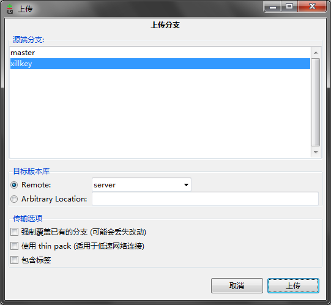  

上传后的版本库如图↓(注意wjh在这几个小时内也做出了自己的更改)  

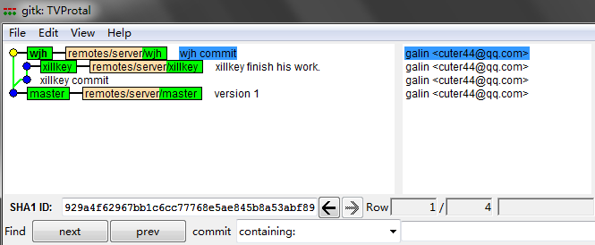

根据老邝原本的设定是要由wjh负责做整合的. 所以此时 xillkey 只需要确认上传完了就可以关机走人了, 当然走之前还需要:  
xillkey(^ω^): 搞掂, wjh记得将我改的部分合并进去~  
wjh(T▽T): はい、はい。。。

> NOTE 在第一次提交的时候 git 会提示你需要一个id和邮件地址, 这很重要, 因为你肯定想知道当初那行代码是谁添加进来的.  
> 要设定自己的id, `编辑(edit)`>`选项(options)`

## git的逻辑结构

先上图:

> git的结构图基于[图解git](http://marklodato.github.io/visual-git-guide/index-zh-cn.html), 卖萌图来自[トラッキーのグータラな日常記録(´∀｀*)←](http://torucky.hatenablog.com/entry/2014/02/23/191539)  

git 的逻辑结构分三层(废话), 首先请向上滚一小段距离, 留意下[主界面](#main-screen)和[分支树](#branch-tree)两张图

* `Working Directory`就是你叭嗒叭嗒敲的代码, 对应于在主界面的未缓存的改动和分支树上的●红点(仅在修改过而又未保存时出现)
* `Stage`是缓存但未提交的文件, 对应于主界面的已缓存的改动和●黄点
* `History`是已保存的部分, 也就是上文说的"毁灭性打击也没关系"的部分(因为保存到这里就很删不掉了), 对应于分支树上的●蓝点  

> HINT 你不必记住那些命令, 但你应该在我提到 commit 的时候知道我在指什么  
  

> NOTE 其实并非真的"删不掉", 前提是你能在**全部**副本上删掉它. 至于怎么做到, 请接着观看以下的部分.  

以上这个栈**独立**且**完整**地存在于每一台参与到版本库的机器上, 而对于(wjh, xillkey, 5+0)组成的开发小队情况则会变成这样:  
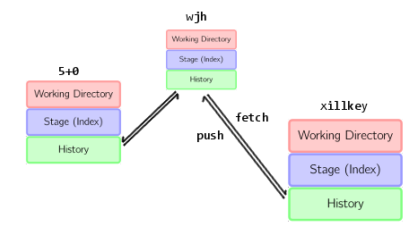

> 唔..好像透视不太对...现在请不要吐槽

这里会引入两个新操作:   

* `推送(push)`是指将自己的分支树同步到别人的机器上(也就是xillkey刚才做的)  
* `拉取(fetch)`是指将别人的分支树同步到自己的机器上  

`push`和`fetch`操作都只能在`History`层上运行, 换言之, 这两个操作不会干扰到正在写的代码, 任何时候都可以放心执行  
提交的代码一旦通过`push`和`fetch`操作散播到其他机器上, 就很难撤销了(因为散播开去了呗). 所以**提交前请务必慎重检查提交内容**, 千万不要将[编译期的垃圾](http://en.wikipedia.org/wiki/Garbage_in,_garbage_out), 帐户名和密码, 胖次或者果照(喂!)提交到版本库, 不然...删-不-掉-的-哦-♪

> HINT 你可以预先告诉git什么是不能提交的, 详情请 [`man gitignore`](http://git-scm.com/docs/gitignore)  

> HINT 另外, 图示的是`中心式版本库`的情况, xillkey也可以与5+0直接进行通信, 这时我们称它为`分布式版本库`.  

# 935日常 - wjh的救赎

(续上)  
(首先请自行脑补一个黑白滤镜)  
曾经, wjh每次听到"合并"这个词, 都会瞬间颓丧到就像...像...(台词机坏掉了不好意思), 然后默默打开 eclipse 逐块地复制粘贴...
  
(现在变回彩色的)  
但是, 自从有了 git, 妈妈再也不用担心 wjh 的合并工作了, ...
(好吧实在没台词了, 去片!)

若干分钟前, wjh接到了xillkey的merge请求. 于是他叹了口气, 保存自己的工作, 打开git GUI 切换到master分支上↓  
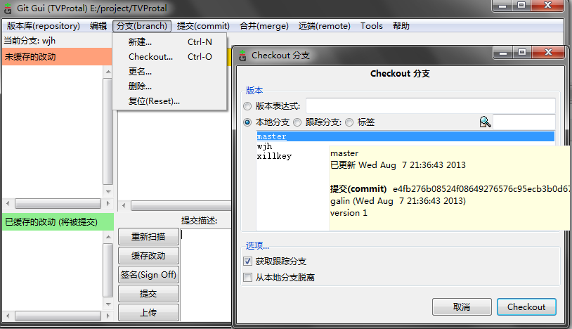

> NOTE 这里, "保存自己的工作" 是指将还没写完的工作按上一章的方法提交一次. 除此之外还存在另一种恰好适用于这个场景的[`储存(stash)`](http://git-scm.com/book/zh/Git-工具-储藏（Stashing）)办法  

现在可以开始merge了, 点 `合并(merge)` > `本地合并(local merge)`↓    
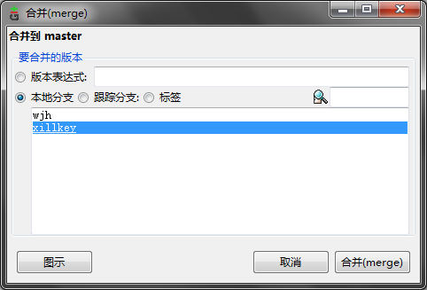  
选择xillkey的分支, 然后合并, 如果没发生冲突的话, 合并就完成了↓  
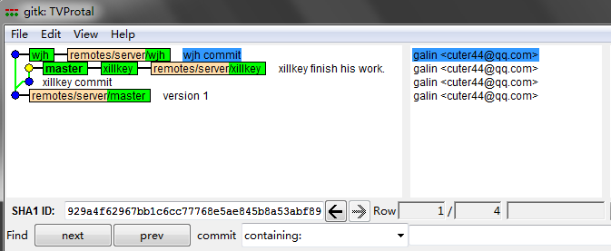
  
> 很抱歉截图被我不小心覆盖掉了, 现在这个是PS出来的orz...

## 分支是什么

直到现在为止, 你大概已经有个模糊的概念了: git的分支树就像RPG的游戏大纲, 可以分支可以合并, 有 good end 也有 bad end. 中间的每一个节点就是故事的一个章节.

> 或者...暗示了什么, 每一次开发都是一次大冒险啊╮(╯□╰)╭

分支之间是互相隔离的, 你在本机上的分支`branch`在别人的机器上会显示为`remotes/host/branch`, 你可以随时与任何分支进行交互(`检出(checkout)`, `提交(commit)`, `合并(merge)`, `变基(rebase)`, etc.).  
git的灵活性是建基于分支特性上的, 因为可以在很大的自由度上操作分支, 比如可以在同一时间存在多套代码(当你为一个功能想到两种实现的时候), 比如可以跨步合并("读后写"的问题). 这些都会在生产环境中遇到, 但现在不会详细论述.  

> 对于 ACM/OI 经验者这里有个额外的tip: 试想象一个非线性链表以及各种指针.

# 935日常 - 5+0是麻烦制造者

> 现在, 拿出你的笔电吧, 我们要订外卖了~  

5点通常都是叫外卖的时候, 既然有了 git 的合并功能, 那么在 QQ 上吆喝谁吃什么再手动收集显然是不科学的事.  
所以, wjh创建了一个调查表what-to-eat.txt来收集订餐状况.  

what-to-eat.txt(`master`分支的内容)

    (空白)

饱睡的galin听到"外卖"两字瞬间暴起以最快速度完成了`checkout`-`commit`-`merge`操作:

what-to-eat.txt(`galin`, `master`分支的内容)

    galin(ﾟДﾟ;):我要吃肉卷饭!!

而xillkey则慢了一步, 在galin修改文件时他才刚好`fetch`完, 当他`merge`的时候, 冲突发生了:  
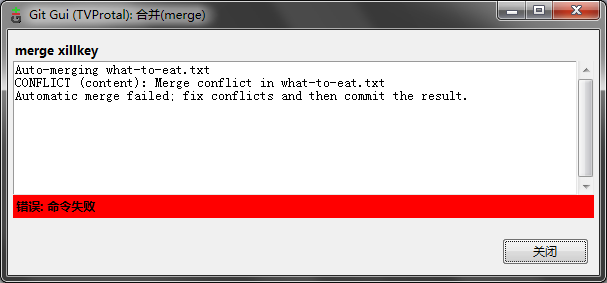  

此时同一文件的不同状态是:

what-to-eat.txt(`xillkey`分支的内容)

    xillkey(‾▽‾"):我要烤鸭饭好了.

what-to-eat.txt(`master`分支的内容)

    <<<<<<< HEAD
    galin(ﾟДﾟ；):我要吃肉卷饭!!
    =======
    xillkey(‾▽‾"):我要烤鸭饭好了.
    >>>>>>> xillkey

同时git主面板会变得色彩斑斓:  
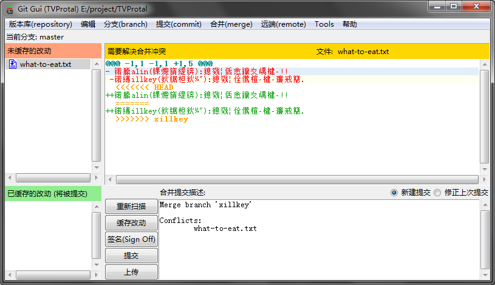  

> 请不要吐槽乱码因为那不是重点
  
其中三行黄色的(对应源文件的三行)就是git加上去的, 它提示了哪里有冲突, 以及冲突的内容. 你需要用文本编辑器修正到你需要的结果, 删除git添加的标记, 然后才能继续提交.

这里按照场景应该将两行都保留下来, 所以直接删掉第1,3,5行.  
然后再次进行 `缓存改动(stage)`, `提交(commit)` 即可.  

> 如果你什么都不改或者漏了哪里没改的话, 你将会被git吐槽:  
> _愚蠢的蓝星人你还没有解决冲突呢真的要保存吗? >是(灰色) >否_

## 关于冲突
大多数情况下 git 能够自动理解要怎么合并你的文件, 就像上一章那样(我们称之为`fast-forward`). 但假如多个人同时修改文件的同一处地方, 就有可能超出它的理解范围了, 这时它需要向人类询问该怎么办(也就是`conflict`).  
所以你也猜到了, 要避免冲突, 最好的办法就是事先要约定好各自可以动的文件和命名域. 5+0从云宏离职部分原因就是队友太水经常引发冲突.

# 额外的参考文献

1. [Github Flavored Markdown Reference](http://github.github.com/github-flavored-markdown/)
2. [Pro Git(中文)](http://git-scm.com/book/zh)
3. [图解Git](http://marklodato.github.io/visual-git-guide/index-zh-cn.html)

# 番外: 作死青年事件簿

> 这里收集了自2013年开始935在git实践中遇到的各种不合理状况:

## 分支树维护

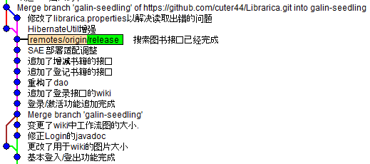  
普通青年: 以单一的版本作为根, 有序地分支和合并分支.  

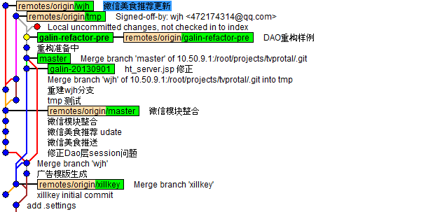  
作死青年: 给别人分发代码时没有附带版本化信息, 拿回来后合并出一吨的冲突只好手动解决.  

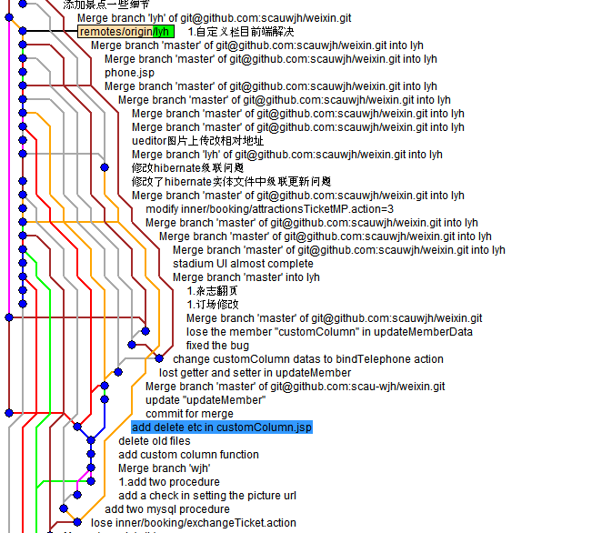  
还有些很有艺术感的...(到底经历了什么才可以变成这样子)

## 提交附言要这样写

↓ 这是一个没什么价值的提交记录, 因为它等于什么都没说  

    整合

↓ 或者嘲讽向...

    Author: zrh <zrh_sky@163.com>  2014-06-21 11:01:40
    Committer: zrh <zrh_sky@163.com>  2014-06-21 11:01:40
    Parent: 71ba9854d896a59a92a30828742ad05a8ede46a4 (测试过滤器)
    Child:  7ebbcaefb9468d7c3063d46f43b26c26a402c949 (Merge branch 'zrh' of http://github.com/scauwjh/weixin into zrh)
    Branches: remotes/origin/master, remotes/origin/zrh
    Follows: 
    Precedes: 

    没修改什么

-------- src/java/com/pk/platform

↓ 这是相对好的实践, 简明扼要地指出这次提交修改了什么

    登录/激活功能追加完成
    
    + Web API, 详情请参见javadoc
      + /authorize/register
        ! 现在还不能发邮件, 但是会通过json返回激活之必要参数
      + /authorize/activate
      * /authorize/login
        + 追加了样例
      * /authorize/logout
        + 追加了样例
      * /authorize/getRsaKey
    + 追加Criteria机能, 详请参考wiki:Criteria
    + 追加了用于RSA加密的实用工具, 详请参考wiki:服务器部署指南

不过, 具体采用何种实践其实也是自由的, 这只是一个建议而已.